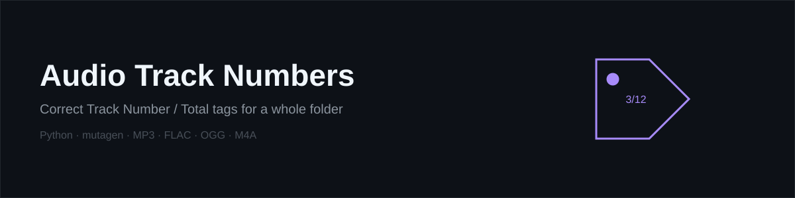

<p align="center">
  
</p>

<p align="center">
  <a href="LICENSE"></a>
  
  
  
</p>

# Audio Track Numbers

A command-line tool that writes correct **Track Number** and **Track Total** tags (for example `3/12`) to every audio file in a folder. It works out the order from the file names, so your player shows the files in the right sequence, even when the playlist is incomplete. Every change is shown in a **preview** before anything is written.

Supported formats: **MP3, FLAC, OGG, M4A/MP4**.

```
30 - Episode.mp3   →   Track 1/10
31 - Episode.mp3   →   Track 2/10
...
39 - Episode.mp3   →   Track 10/10
```

---

##  Table of contents

- [Why this tool](#why-this-tool)
- [Features](#features)
- [Requirements](#requirements)
- [Installation](#installation)
- [Usage](#usage)
- [How it works](#how-it-works)
- [Honest limitations](#honest-limitations)
- [Troubleshooting](#troubleshooting)
##  Contributing
- [License](#license)

---

##  Why this tool

Music and audiobook players sort by the **Track Number tag**, not by file name. When that tag is empty or wrong, episodes play out of order. This tool fixes the tags in one pass for the whole folder, across every common audio format, instead of editing each file's metadata by hand.

It also handles a common real-world problem: **incomplete series**. If you only downloaded episodes 30 to 39, you probably want them to be tracks 1 to 10, not 30 to 39. The tool uses the numbers in the file names only to decide the *order*, then assigns tracks `1…N` based on each file's position among the files actually present.

---

##  Features

- **Preview before writing** – shows every file that would change (old tag → new tag) and asks for confirmation. Nothing is modified until you answer `y`. Pass `--yes` to skip the prompt.
- **Relative track numbering** – track number = the file's rank among the files that are actually present.
- **Track Total** – automatically set to the number of audio files in the folder.
- **Smart number detection** – finds the track number anywhere in the file name (start, middle, or end) and ignores numbers that are clearly something else:

  | File name | Detected number | Why |
  |---|---|---|
  | `01 - Song.mp3` | 1 | Leading number |
  | `Song - 01 - Artist.mp3` | 1 | Number in the middle |
  | `Artist - Song (Track 07).mp3` | 7 | Explicit "Track" label |
  | `Song #12.mp3` | 12 | `#` label |
  | `Song (2019).mp3` | none | Looks like a year |
  | `Song - 320kbps.mp3` | none | Followed by a unit (bitrate) |
  | `CD1 - Song.mp3` | none | Looks like a disc number |

- **Skips files that are already correct** – re-run it any time after adding new files; only new or wrong files are modified.
- **Fallback ordering** – files with no reliable number are placed using natural sort order (`2` before `10`).
- **Multiple formats in one folder** – MP3, FLAC, OGG, and M4A/MP4 are each written using the correct tag format.
- **Clear per-file report** – `[fixed]`, `[skip]`, or failure message for each file, plus a final summary.

---

##  Requirements

- Python **3.6** or newer
- [mutagen](https://mutagen.readthedocs.io/) (audio tag library)

```bash
pip install mutagen
```

**Termux (Android)**
```bash
pkg update
pkg install python
pip install mutagen
```

---

##  Installation

```bash
git clone https://github.com/eldqyqy2007/audio-track-numbers.git
cd audio-track-numbers
pip install -r requirements.txt
```

Or download `set_track_numbers.py` and run it directly.

---

##  Usage

Pass the folder path as an argument:

```bash
python3 set_track_numbers.py "/path/to/folder"
```

Or run it without arguments and enter the path when asked:

```bash
python3 set_track_numbers.py
```

Add `--yes` (or `-y`) to skip the confirmation question, for example when running the tool from a script:

```bash
python3 set_track_numbers.py "/path/to/folder" --yes
```

On Termux, run `termux-setup-storage` once, then use a path under `~/storage/shared/`:

```bash
python3 set_track_numbers.py ~/storage/shared/Music/course
```

###  Example output

```text
Found 4 audio file(s). Checking existing tags...

Preview of the changes (nothing has been written yet):

  30.mp3:  (no track tag)  ->  1/4
  32.mp3:  9/8  ->  3/4
  33.mp3:  (no track tag)  ->  4/4

1 file(s) already correct and will be left untouched.

Write these tags to 3 file(s)? (y/n): y

[fixed]  30.mp3  ->  Track 1/4
[fixed]  32.mp3  ->  Track 3/4
[fixed]  33.mp3  ->  Track 4/4

Done. Updated: 3, already correct (skipped): 1, failed: 0.
```

Answer `n` at the confirmation prompt to cancel; no file is changed. If every file is already correct, the tool reports that and exits without asking anything.

---

##  How it works

1. **Collect** – finds all supported audio files in the folder (sub-folders are not searched) and sorts them naturally by name.
2. **Detect** – scores every number in each file name and picks the most likely track number. Explicit labels (`Track 7`, `#12`) score highest; years, bitrates, and disc numbers score lowest. If nothing scores well, the file is treated as "no number".
3. **Rank** – sorts files by detected number and assigns positions `1…N`. Files with no number come after the numbered ones, in natural name order.
4. **Compare** – reads the existing Track Number / Total tags. Files that already have the correct values are left out of the plan.
5. **Preview & confirm** – prints every file that would change, its current tag, and its new tag, then waits for `y` or `n` (skipped automatically with `--yes`). Nothing has been written at this point.
6. **Write** – after confirmation, writes the new tags using the correct format for each file type.

| Format | How the tags are stored |
|---|---|
| MP3 | ID3 `tracknumber` as `N/Total` |
| FLAC / OGG | `tracknumber` and `tracktotal` fields |
| M4A / MP4 | `trkn` as `(N, Total)` |

---

##  Honest limitations

- **Track Total counts every supported audio file in the folder.** If the folder mixes several albums or series, keep each one in its own folder.
- **Only tags change.** File names and audio content are never modified.
- **Detection can guess wrong.** A name like `Song 2Pac.mp3` is read as track `2`. Names without any usable number are placed after the numbered files, so double-check the preview on unusually named files.
- **Ranks, not literal numbers.** Files `00…100` become tracks `1…101`, and files `30…39` become tracks `1…10`. This is intentional, but worth knowing before you confirm.
- **No undo after confirmation.** The preview is the safety net; once you type `y` (or use `--yes`), tags are written immediately with no automatic rollback. Consider trying the tool on a **copy** of your folder the first time.
- **Other tags are left as they are.** Title, artist, album, and so on are untouched — only the track number / total fields change.
- **No automated test suite.** Detection logic has been checked manually against a range of file-name patterns, not with CI or unit tests.

---

##  Troubleshooting

**"The 'mutagen' library is required"**
Install it with `pip install mutagen`.

**"Invalid path or folder does not exist"**
Check the path for typos and wrap it in quotes if it contains spaces. On Termux, run `termux-setup-storage` first.

**A file shows `[!] Failed to update`**
The file may be read-only, corrupted, or in an unsupported variant. The error message after the file name explains why. Other files are still processed.

**Some files got unexpected numbers**
Check their names for other numbers (dates, parts). Rename them so the track number is clear, for example `07 - Title.mp3`, and run the tool again.

---

##  Contributing

Issues and pull requests are welcome. Ideas for future improvements:

- Undo log (restore the previous tags after a run)
- Recursive folder scanning
- Support for more formats (WAV, WMA, Opus)

---

##  License

This project is licensed under the [MIT License](LICENSE).
